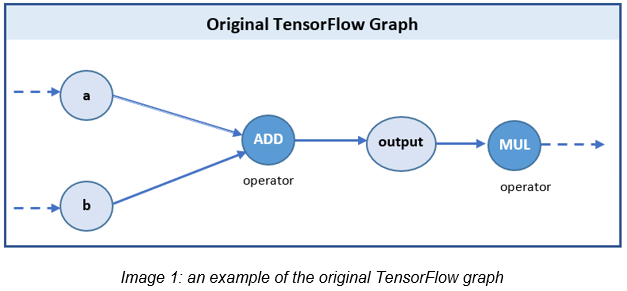

# An experiment of Fault Injection Testing in Autonomous Vehicle
Fault injection (FI) is an important way to access the reliability of a computer system. By injecting faults, we get to study the system’s detection and recovery mechanism which may help in building a more robust system. Through fault injection, we can artificially induce both hardware and software level faults into the system. A fault can be simulated by either hardware or software. Software-implemented Fault Injection techniques, however, are more preferable as they are low cost, controllable, and easily deployable.
There are several software-implemented Fault Injection Tools out there that inject faults at different levels of the system from assembly code level to application’s source code level. Some of them include NF-Tape, Xception, and the GooFI of Google.

In this project, we have used the **TensorFI** Fault Injection framework because it works with **TensorFlow** and our aim was to inject faults in the **PilotNet** model, an autonomous vehicle machine learning model, which also used TensorFlow.


## _PilotNet_: End to End Learning for Self-Driving Cars
<p align="center">
   
</p>

A TensorFlow implementation of this [Nvidia paper](https://arxiv.org/pdf/1604.07316.pdf) with some changes. 

For more information about how to install and use PilotNet, please read https://github.com/Durant35/PilotNet.git

## TensorFI: A fault injector for TensorFlow applications
TensorFI is a fault injection framework that can simulate both hardware and software faults of any Machine Learning algorithms that are written in the TensorFlow framework. Unlike the other fault injection techniques that can be used within a particular application, TensorFI is able to perform FI on generic ML applications. It specializes in performing interface-level fault injection. Furthermore, it is easy to use by developers because it allows them to directly operate on TensorFlow operators and graphs.
TensorFI works by cloning the TensorFlow graph and creating a Fault Injection graph by modifying the original and yet keeping the original intact. TensorFI provides a flexible configuration that allows developers to choose amongst different fault injection types, injection modes, and the target operators to inject these faults. The Fault Injection graph is similar to the original with the additional capability of injecting faults based on the developer’s chosen configurations. This can be illustrated visually through image 1 and 2. Figure 1 shows an example of a TensorFlow graph with 2 operators (MUL, ADD) and some tensor inputs. TensorFI clones the graph to create a fault injection graph as can be observed in figure 2. The structure of the original graph remains the same, but there is a fault configuration option injected into the output of the operators. The developer may then choose to inject faults in the Add operator by configuring the system and selecting the fault injection type to flip a bit or change the output to a new random value. 
<p align="center">
   
   <br>
   
</p>

For more information about how to install and use TensorFI, please read https://github.com/DependableSystemsLab/TensorFI

## Dataset
The demo training and testing dataset can be found on the folder [./data/dataset](https://github.com/PhuongLe/PilotNet/tree/master/data/datasets) 

## Setup
Our test was done with the following environment setup:
●	Ubuntu 16.4
●	Python 2.7
●	TensorFlow 1.10

The test can be done by following steps
1. Install required packages as described on PilotNet's repository
2. Install required packages as described on TensorFI's repository
3. Train PilotNet model (or use the pre-trained model.ckpt under folder [./data/models](https://github.com/PhuongLe/PilotNet/tree/master/data/models))
4. Run test script as belows 
```bash
   $ cd $ROOT
   $ (pilotnet-tensorfi-env) $ ./scripts/demo.sh -tensorfi
   ```

## Evaluation metrics

The four metrics that were used to evaluate the fault resilience of PilotNet are:
1.	**OneFaultPerRun with fault type BitFlip-Element** - This metrics injects one fault per run wherein the output of the target operator flips one single bit of data. 
2.	**OneFaultPerRun with fault type Rand-Element** - This metrics injects one fault per run wherein the output of the target operator is switched to a random value within the output value range [0, Output Value].
3.	**Fault Injection Rate (0.1 to 0.5) with fault type BitFlip-Element** - This metrics injects faults at the fault injection rate between 0.1 to 0.5 wherein the output of the target operator flips one single bit of data. 
4.	**Fault Injection Rate (0.1 to 0.5) with fault type Rand-Element** - This metrics injects faults at the fault injection rate between 0.1 to 0.5 wherein the output of the target operator is switched to a random value within the output value range [0, Output Value].

The experiments were done on a list of random images and 100 fault injection trials were performed on each image's processing round. Each metric was analyzed on different operators of the PilotNet system. The percentage of SDC error rate was calculated that resulted in the output of the steering angle being 5 degrees different from the golden value. The complete report of the analysis can be accessed via the team’s GitHub Repository under the folder “report”. The results of the analysis can be observed in image 3 and 4.

## Analysis
<p align="center">
   
</p>
Image 3 depicts the result of the first two metrics which inject one BitFlip-Element or Rand-Element fault in every run. The key observations from the graph are: 
1.	The top four most sensitive operators to the faults are MUL, Add, Relu, and MATMUL. Those operations could cause more than 50% or even nearly 90% error rate if there was even a single bit flip on the output. 
2.	In comparing Rand-Element and BitFit-Element fault injection types, we observe that Rand-element fault type results in lower SDC rates in nearly all operators except for MATMUL. This could be attributed to the fact that random value fault causes lesser value deviation than the bit-flip fault type and also random value fault is less likely to occur than bit-flip fault type in reality. 

<p align="center">
   
</p>

Image 4 shows the graphs obtained from injecting BitFlip and Random Element faults at varying fault injection rate to the multiple operators of the system. As expected, we observe that in both fault injection types, the higher fault injection rates result in higher SDC rates for all operators. Furthermore, similar to the previous analysis, the four most sensitive operators are MUL, Add, Relu, and MATMUL. These consistent observations lead us to believe that the PilotNet model is easily affected by even a single bit flip fault or randomly shuffled data. Furthermore, it shows the most vulnerable operators are also the most commonly used operators of the model giving us a larger cause for concern. Having identified the system vulnerabilities and propensity of error upon fault injection, we must identify ways to avoid the introduction of such faults into the system. The following section makes some recommendations for improving the system’s robustness. 


## About us
This project is done as our capstone project for our Master of Engineering Leadership program at UBC. Our team includes me PHUONG LE (PHOEBE), ANUPAM YADAV, and GEETIKA SINGH POTDAR. 